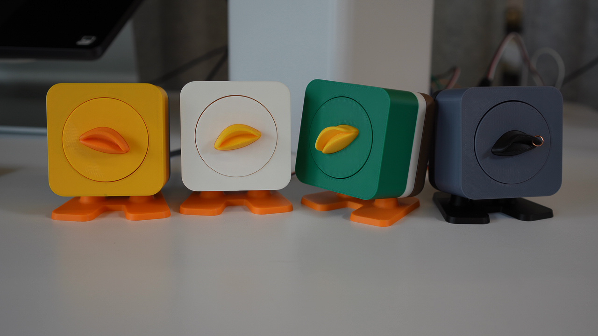

# Duck Duck Duck

[](LICENSE)
[](firmware/LICENSE)

<a href="https://duck-duck-duck.edges.ideo.com/"></a>

A companion for Claude Code on Mac. It watches your coding sessions, scores every prompt and response, speaks opinionated reactions, and handles permissions by voice. Optionally connects to a [physical duck](https://duck-duck-duck.edges.ideo.com/) for hardware reactions.

**[Learn more at duck-duck-duck.edges.ideo.com](https://duck-duck-duck.edges.ideo.com/)**

🔒 [**Default intelligence is fully on-device and private**](#data--privacy) on M3+ Macs. M1/M2 users get the best experience with a cloud API key ([free options available](#evaluation)). No cloud audio regardless — your voice never leaves your machine.

## Requirements

- **macOS 26** (Tahoe) or later, **Apple Silicon** (M1 or later)
- **Claude Code** or **Claude Desktop** — [get Claude Code](https://docs.anthropic.com/en/docs/claude-code/overview)

> **On-device scoring is designed for M3+ Apple Silicon.** It works on M1/M2 but runs slowly (~30-60s per eval). For instant reactions on older hardware, add a cloud API key — see [Evaluation](#evaluation) below.

## Install

1. Download `DuckDuckDuck.dmg` from [GitHub Releases](https://github.com/ideo/Rubber-Duck/releases)
2. Drag to Applications, launch
3. Grant **Microphone** and **Speech Recognition** when prompted — all audio stays on-device
4. Accept the **Terms of Use**
5. The app walks you through installing Claude and the plugin
6. Open a Claude Code session (CLI or Desktop) — the duck is watching

<details>
<summary>Build from source</summary>

```bash
git clone https://github.com/ideo/Rubber-Duck.git
cd Rubber-Duck/widget
make run
```

Then use **Setup → Install Plugin** from the menu bar.

Requires Xcode with Swift 6.2+ (macOS 26 SDK).

</details>

## How It Works

```
You  ──►  🦆 Hardware Duck  ──►  Duck Widget (SwiftUI)  ◄──  Claude Code / Desktop
          mic + speaker          eval engine (Foundation      plugin hooks (prompt,
          servo + LED            Models / Haiku / Gemini)     response, permission)
               ▲                        │
               │                   voice out (TTS)
               └────────────────── servo + LED commands
                                   speaker audio

          (no Duck, Duck, Duck device? laptop mic + speakers work too)
```

1. **Hooks** fire on Claude Code events and POST to the widget's embedded server
2. **Eval engine** scores text on-device via Apple Foundation Models (free, sub-second on M3+) — returns scores + a spoken reaction
3. **Widget** animates the duck face, speaks the reaction, optionally drives hardware via USB serial
4. **Voice permissions** — the duck summarizes what Claude wants to do and asks. Say "yes", "always allow", "deny". Foundation Models classifies ambiguous responses.
5. **Voice commands** — say "ducky [command]" to inject text into Claude Code via tmux
6. **Wildcard voice** — score-gated AI picks from 10 voices per reaction (normal, grave, cheerful, dramatic, whisper, etc.)

## Modes

| Mode | What it does | Mic |
|------|-------------|-----|
| **Companion** | Reacts to everything, voice permissions, wake word | On |
| **Permissions Only** | Silent until a permission arrives | On |
| **Companion (No Mic)** | Reacts and speaks, click-only permissions | Off |
| **Relay** (Experimental) | Speak directly to Claude CLI via tmux | On |

## Evaluation

Each prompt and response is scored from -1.0 to +1.0:

| Dimension | What it measures |
|-----------|-----------------|
| **creativity** | Novel/surprising vs boring/obvious |
| **soundness** | Technically solid vs flawed |
| **ambition** | Bold undertaking vs trivial tweak |
| **elegance** | Clean/clear vs hacky/convoluted |
| **risk** | Could break things vs safe |

Defaults to Apple Foundation Models (on-device, free, **designed for M3+**). Switch to Claude Haiku or Gemini Flash from the menu bar for higher-quality scoring. See [Data & Privacy](#data--privacy) for details.

<details>
<summary>M1/M2 Mac? Use a cloud API key for snappy reactions</summary>

On-device scoring runs slowly on M1/M2 (~30-60 seconds per eval). For instant results:

**Gemini Flash (free tier, no credit card):**
1. Go to [aistudio.google.com](https://aistudio.google.com/apikey) and sign in with Google
2. Click Get API Key → Create API Key
3. Paste it into Preferences → Intelligence → Gemini

**Claude Haiku (~$0.001 per eval):**
1. Go to [console.anthropic.com](https://console.anthropic.com/settings/keys) and create an account
2. Add a payment method (pay-as-you-go)
3. Go to API Keys → Create Key
4. Paste it into Preferences → Intelligence → Anthropic

</details>

## Voice

| What you say | What happens |
|---|---|
| "ducky, refactor the auth module" | Command sent to Claude Code |
| "yes" / "no" (during permission) | Approves or denies |
| "always allow" (during permission) | Applies the session-wide suggestion |
| "ducky, quit" | Duck says goodbye |

## Troubleshooting

- **"Claude Code not found"** — [Install Claude Code](https://claude.com/download), then retry the plugin install.
- **No mic permission dialog** — System Settings → Privacy & Security → Microphone → enable Duck Duck Duck.
- **Duck not reacting** — Make sure the widget is running (duck in menu bar) and you have an active Claude session. Try `/reload-plugins`.
- **Duck reacting slowly** — On M1/M2, on-device scoring takes 30-60s per eval. The duck IS working, just thinking. Switch to Gemini or Haiku in Preferences → Intelligence for instant reactions.
- **Plugin not loading** — Start a new session. Hooks are cached at session start.

## Data & Privacy

By default, Duck Duck Duck's intelligence is **fully contained to your machine**.

| Component | Where it runs | Data sent externally |
|-----------|--------------|---------------------|
| **Apple Foundation Models** (default) | On-device | None. Private and free. Not used for training. |
| **Voice (STT + TTS)** | On-device via Apple APIs | None. No audio leaves your machine. |
| **Claude Haiku eval** (opt-in) | Anthropic API | Prompts/responses sent to Anthropic for scoring. |
| **Gemini Flash eval** (opt-in) | Google API | Prompts/responses sent to Google for scoring. |

In Foundation Models mode (the default), the entire experience — eval scoring, voice recognition, text-to-speech, and the help system — runs privately on your machine at zero cost. [Apple does not use your interactions to train Foundation Models.](https://machinelearning.apple.com/research/introducing-apple-foundation-models)

**M1/M2 note:** On-device scoring is designed for M3+ and runs slowly on older hardware. The app detects this and recommends switching to a cloud provider. If you do, your prompts and responses will be sent externally for scoring (see below). Voice and audio always stay on-device regardless.

**Optional cloud eval:** If you switch to Haiku or Gemini, your prompts and responses are sent directly to the respective API for evaluation. You provide your own API key at your own discretion. Keys are stored locally in `~/Library/Application Support/DuckDuckDuck/` and are never shared. Costs are between you and the API provider. There is no intermediary server — the widget calls the APIs directly.

## Project Structure

```
widget/          SwiftUI macOS app — the duck's brain
plugin/          Claude Code plugin — hooks that connect to the widget
plugin-gemini/   Gemini CLI extension — experimental
firmware/        Arduino firmware for hardware duck (ESP32-S3, Teensy 4.0)
scripts/         Shell scripts (tmux launcher, hook helpers)
hardware/        CAD (SolidWorks, STEP) and EE (Eagle, Fusion 360) source files
```

### Widget (`widget/`)

Self-contained SwiftUI app. Zero external dependencies — Network.framework for HTTP/WS, CryptoKit for WebSocket, Foundation Models for eval.

<details>
<summary>Key components</summary>

**Server:** DuckServer (HTTP+WS on :3333), LocalEvaluator (Foundation Models), ClaudeEvaluator (Haiku), GeminiEvaluator (Flash), PermissionGate, WebSocketBroadcaster, TmuxBridge

**Speech:** SpeechService (orchestrator), STTEngine (Apple Speech), TTSEngine (macOS `say`), SerialMicEngine/SerialTTSEngine (ESP32 audio streaming), WakeWordProcessor, PermissionVoiceGate, PermissionClassifier (Foundation Models fallback), AudioDeviceDiscovery

**UI:** DuckView (liquid glass + animated face), ExpressionEngine (scores → expressions), DuckCoordinator (side effects), MelodyEngine (Jeopardy thinking hum)

**Hardware bridge:** SerialManager (USB serial), SerialTransport (binary framing), EvalService (transport-agnostic)

</details>

### Plugin (`plugin/`)

Hooks fire on Claude Code events and POST to the widget.

| Hook | What it does |
|------|-------------|
| **SessionStart** | Health check — tells Claude if the duck is active |
| **UserPromptSubmit** | Sends your prompt for eval |
| **Stop** | Sends Claude's response for eval |
| **PermissionRequest** | Voice-confirmed permission gate |
| **SessionEnd** | Duck acknowledges session close |
| **PreCompact / PostCompact** | Jeopardy thinking melody during context compaction |
| **StopFailure** | Duck reacts to API errors |
| **PostToolUse** | Clears permission state after CLI approval |

### Hardware (Optional)

Connect the [IDEO Duck, Duck, Duck](https://duck-duck-duck.edges.ideo.com/) or build your own. The widget auto-detects boards via USB. All parts print without supports — pop off the bed and assemble.

- [`hardware/README.md`](hardware/README.md) — enclosure CAD, 3D print settings, assembly instructions, PCB design
- [`firmware/README.md`](firmware/README.md) — supported boards, wiring, flashing, serial protocol

## Development

```bash
cd widget && make run       # release build + launch
cd widget && make sandbox   # re-sign with App Sandbox entitlements
cd widget && make debug     # debug build in terminal
cd widget && make dmg       # notarized DMG for distribution
```

### Reducer Pattern

Each output target has its own reducer mapping eval dimensions to what it can express:

| Dimension | Widget | Hardware |
|-----------|--------|----------|
| soundness | eye shape | servo base angle |
| elegance | transition speed | easing smoothness |
| creativity | hue shift + eye widening | frequency range |
| ambition | scale | servo speed |
| risk | rotation angle | oscillation/wiggle |
| thinking | eye darting + Jeopardy hum | — |
| permission | exclamation mark eyes | alert chirp |

<details>
<summary>Gemini CLI support (experimental)</summary>

The duck can also watch [Gemini CLI](https://github.com/google-gemini/gemini-cli) sessions. Install via **Experimental → Install Gemini Extension** in the menu bar. Observe-only — scores and speaks but cannot relay permission decisions.

</details>

## License

Software (widget, plugin, scripts) — [MIT License](LICENSE)

Hardware (firmware, PCB, enclosure) — [CERN Open Hardware Licence v2 — Permissive](firmware/LICENSE)

## Limitation of Liability

THE ITEM AND THE SOFTWARE ARE PROVIDED AS-IS, AND IDEO MAKES NO WARRANTIES OF ANY KIND, WHETHER EXPRESS, IMPLIED, OR STATUTORY, INCLUDING ANY WARRANTIES OF MERCHANTABILITY, NON-INFRINGEMENT OF INTELLECTUAL PROPERTY RIGHTS, PRODUCT LIFE OR LONGEVITY, OR FITNESS FOR A PARTICULAR PURPOSE, ALL OF WHICH ARE EXPRESSLY DISCLAIMED. USE OF THE ITEM AND THE SOFTWARE IS AT YOUR OWN RISK.

TO THE FULLEST EXTENT ALLOWED UNDER APPLICABLE LAW, IN NO EVENT SHALL IDEO BE LIABLE FOR ANY INCIDENTAL, CONSEQUENTIAL, SPECIAL, OR INDIRECT DAMAGES OF ANY KIND, INCLUDING WITHOUT LIMITATION THOSE RELATING TO LOSS OF USE, LOST PROFITS OR REVENUES, INTERRUPTION OF BUSINESS, AND/OR COST OF PROCUREMENT OF SUBSTITUTE GOODS, REGARDLESS OF (A) THE FORM OF ACTION, WHETHER IN CONTRACT, TORT OR OTHERWISE, (B) WHETHER OR NOT FORESEEABLE, AND (C) EVEN IF ADVISED OF THE POSSIBILITY OF SUCH DAMAGES. IDEO'S AGGREGATE LIABILITY FOR ANY DAMAGES OR LIABILITY CAUSED BY THE ITEM OR THE SOFTWARE SHALL NOT EXCEED $50 IN EACH CASE.
