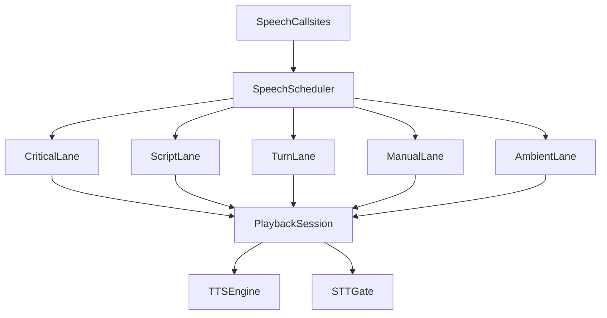

# Speech Orchestration

## Goals

The duck speaks in several very different product contexts:

- permissions that must be answered in order
- conversation/help turns that should feel immediate
- long-form guidance and story narration
- manual previews and install feedback
- ambient chatter like greetings and eval reactions

The orchestration layer should keep those use cases legible without turning the duck into an audio backlog.

## Speech Families

### Critical

- Permission prompts
- Permission repeats
- Permission acknowledgements
- Gemini permission alerts

These are the only utterances that need durable FIFO behavior.

### Turn-Based

- Wake acknowledgements
- Command acknowledgements
- Thinking fillers
- Help answers
- Backstory unlock dialogue
- Relay-facing spoken responses

These belong to a single conversational turn. Placeholder speech should be replaceable by the real answer for the same turn.

### Scripted

- Setup guide
- Full Moby Duck reading

These are exclusive narrated sessions. They should be chunked rather than handled as one giant utterance so a permission prompt or user stop does not leave the system in an awkward state.

### Manual

- Voice previews
- Wildcard / silent announcements
- Mode announcements
- Plugin installer feedback

These are explicit user-driven actions. They should be responsive and latest-wins.

### Ambient

- Launch greeting
- Session-connect greeting
- Eval reactions
- Session-end quips
- Stop-failure reactions

These are informative but lossy. If the duck is busy with something more important, they should collapse or drop.

## Scheduler Model

The scheduler uses multiple logical lanes instead of a single global FIFO:

- `critical`
- `script`
- `turn`
- `manual`
- `ambient`

Only `critical` is durable FIFO. Every other lane is intentionally lossy.

## Utterance Metadata

Each utterance is scheduled with metadata that describes how it should behave:

- `lane`: critical, script, turn, manual, ambient
- `kind`: permission, answer, filler, reaction, greeting, preview, scriptStep
- `scopeId`: permission request id, turn id, script id, or manual group id
- `policy`: fifo, latestWins, replaceScope, dropIfBusy, exclusiveSession
- `interruptibility`: byCriticalOnly, byUserAction, freelyInterruptible
- `skipChirpWait`: whether serial playback should skip chirp sequencing

## Lane Rules

### Critical Lane

- Strict FIFO
- Only permissions live here
- May interrupt any non-critical utterance
- Repeats reuse the active permission request instead of creating a new backlog item

### Turn Lane

- At most one active conversation turn
- Placeholder speech such as wake ack or thinking filler is replaceable within the same `scopeId`
- The real answer should supersede earlier placeholder speech from the same turn
- Critical speech may interrupt it

### Script Lane

- Owns setup guide and full-story narration
- Runs as chunked steps under a single script scope
- Critical speech may interrupt it
- Manual user actions may cancel it
- Ambient speech should never interleave with it

### Manual Lane

- Latest-wins
- Used for explicit UI-driven actions
- Can interrupt ambient speech
- Can interrupt scripted narration because the user explicitly asked for something else
- Should not interrupt active permissions

### Ambient Lane

- Lossy, single-slot behavior
- Collapse by category when possible
- Never build a backlog
- Never interrupt more important work

## Collision Rules

### Permission During Story

1. Story chunk is active in `script`
2. Permission arrives in `critical`
3. Script playback is interrupted
4. Permission prompt plays
5. After resolution, the next story chunk resumes

Because scripted speech is chunked, resuming from the next chunk is acceptable and avoids replaying a long block.

### Greeting Overlap At Startup

Launch greeting and session-connect greeting are both ambient.

Behavior:

- collapse by greeting category
- latest relevant greeting wins within the startup window
- if a turn or permission starts first, drop both greetings

### Filler Versus Real Answer

1. User asks a help question
2. Thinking filler enters `turn`
3. Real answer becomes available for the same `turn` scope
4. Filler is replaced instead of queued behind the answer

This avoids the current pattern where multiple sequential `speak()` calls cancel each other unpredictably.

### Voice Preview Spam

Voice previews are `manual` latest-wins.

If the user scrubs across multiple voices:

- cancel the previous preview
- keep only the newest preview
- do not queue every preview

## `say` Session Control

The local `say` path needs explicit playback-session ownership. Today, a new utterance kills the previous `say` process immediately, which is the main reason speech gets truncated.

The safer model is:

- every playback gets a unique `playbackSessionId`
- all completion paths must prove they still own the active session before mutating state
- every child process, including fallback retry on system output, is tracked under that same session
- microphone gating stays attached to the active session, not to whichever async callback happens to finish last
- restart-listening logic should react to a single playback completion event instead of polling mute state

This prevents stale completions and fallback processes from reopening the mic gate or racing a newer utterance after they have been superseded.

## Playback Policies

### Replace

Used for:

- filler replaced by answer
- latest voice preview
- ambient greeting collapse

The outgoing session is cancelled with a replacement reason. The new session becomes the active owner immediately.

### Hard Cancel

Used for:

- user stop
- duck turn-off
- app shutdown

The current session is cancelled and no follow-up speech is automatically queued unless the caller explicitly requests it.

### Natural Finish

Used when the utterance is allowed to finish and the scheduler advances normally to the next eligible item.

## Why This Avoids Audio Drops

The desired behavior is not “never replace audio.” It is “replace audio intentionally, with one active owner.”

The session-based design avoids the observed swallowed-audio behavior because:

- a stale session cannot clear mute state after a newer session starts
- fallback retry audio is no longer orphaned outside engine ownership
- restart-after-speech is tied to the active completion event instead of a mute poll race
- lossy lanes stop enqueueing low-value speech that would otherwise interrupt more important utterances

## Verification Scenarios

- permission prompt arrives during eval reaction
- permission prompt arrives during full-story narration
- help filler starts and answer lands quickly
- launch greeting and session-connect greeting fire close together
- rapid voice-preview changes only play the latest preview
- user stop clears active narration without speaking another unwanted quip
- local `say` fallback still obeys active-session ownership and does not overlap or reopen the mic gate incorrectly
